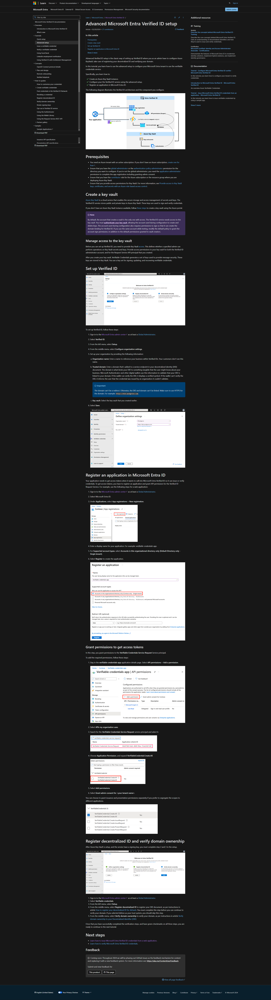

## Goals
Create service principal with expected application permissions to work with Verified ID API

## Actions
- Login to the tenant
- create new application (service principal)
- add required permissions (link)[https://learn.microsoft.com/en-us/entra/verified-id/verifiable-credentials-configure-tenant#grant-permissions-to-get-access-tokens]
- create a new secret and store in the secure place

## Verification Steps
- tenantId
- clientId
- clientSecret

## MS Documentation
https://learn.microsoft.com/en-us/entra/verified-id/verifiable-credentials-configure-tenant#register-an-application-in-microsoft-entra-id

## ScreenGrab from MS Page
