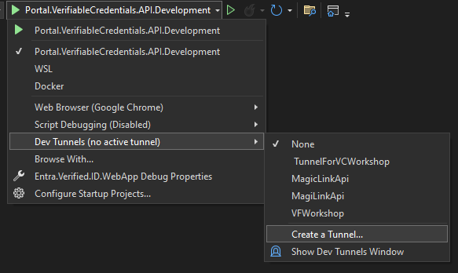
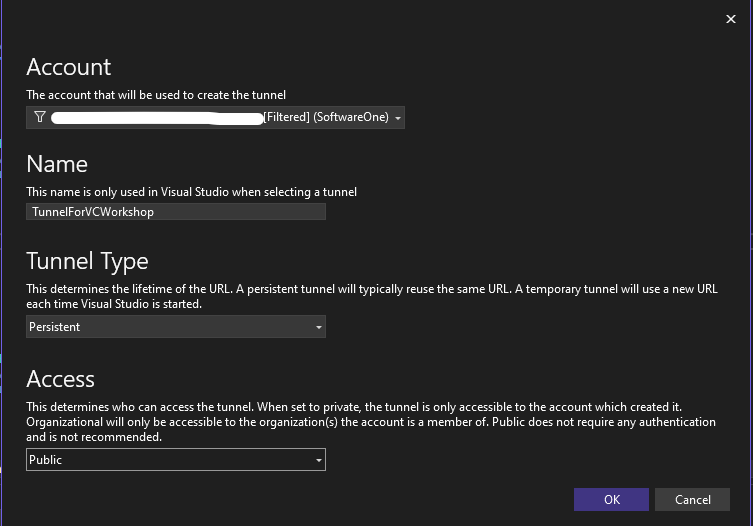
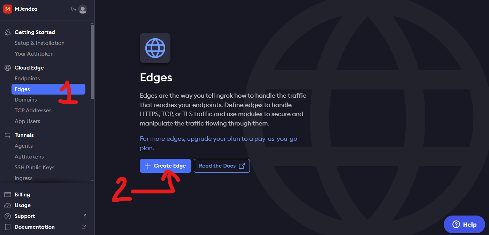

## Goals
Enable https://localhost:5000 to be accessible from the internet.

There is a callback from Entra Verified ID endpoint - so the API must be public.

## Actions

- download and install ngrok
- Login to the https://ngrok.com
- create edge with endpoint based on the instruction
- run ngrok tunnel pointing to the http://localhost:5000

Or if You use Visual Studio 

- create public Dev Tunnel in Visual Studio:



- update HOST for the Asp.Net Application:
```
public class HostConfigurationService : IHostConfigurationService
{
    public string GetRequestHostName()
    {
        return "https://your-public-host-from-dev-tunnel.ms";
    }
}
```
- run application with Dev Tunnel

## Verification Steps
- access api via ngrok tunnel URL or Dev Tunnel

## Screen

