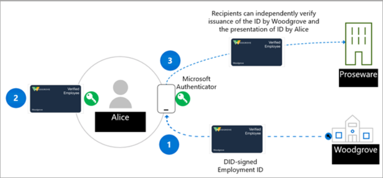

## Goals
- issue your credential and store on Microsoft Authenticator App

## Big Picture


## Actions
Open Solution with VisualStudio or Rider `iam\workshop-verified-id\src\Entra.Verified.ID.Workshop.sln`

### update app settings file service principal data
```json
  "EntraTenantServicePrincipal": {
    "TenantId": "PUT_YOUR_TENANT_ID_HERE",
    "ClientId": "PUT_YOUR_CLIENT_ID_HERE",
    "ClientSecret": "PUT_YOUR_CLIENT_SECRET_HERE"
  },
```

### update credential data
```json
  "GuardianFaceCheckCard": {
    "ApiKeyForVerifiedCredentialsCallback": "YOUR_UNIQE_API_SECRET_FOR_CALLBACK",
    "Purpose": "Provide your Workshop Identity",
    "CredentialType": "YOUR_CREDENTIAL_TYPE_NAME",
    "IssuerAuthority": "YOUR_ISSUER_DID",
    "VerifierAuthority": "SAME_YOUR_ISSUER_DID",
    "CredentialManifestUrl": "MANIFEST_URL_FROM_PORTAL",
    "IssuanceCallbackUrl": "api/issuance/callback",
    "PresentationCallbackUrl": "api/presentation/callback"
  }
```

## Verification Steps
- you should see QR code 
- the flow is cross device
- scan the QR code with your Authenticator App to store the credential on the mobile - in the Authenticator Wallet
- you should be able to store and review your credential in the Microsoft Authenticator App

## MS Documentation
https://learn.microsoft.com/en-us/entra/verified-id/verifiable-credentials-configure-issuer#create-the-verified-credential-expert-card-in-azure