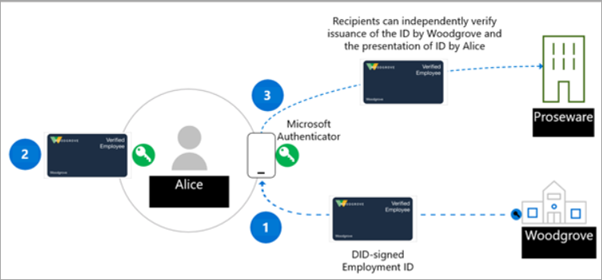
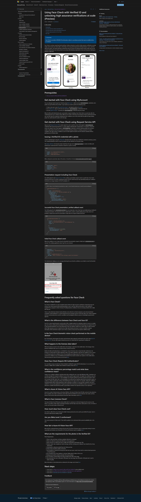

## Goals
- issue your credential and store on Microsoft Authenticator App

## Actions
- run the flow to present the credential wihout face check
- run the flow to present the credential with face check - does it work?

## Big Picture


### Flow


### Update presetation request
To enable Face Check, the payload of the presentation request must meet certain expectations as outlined [here](https://learn.microsoft.com/en-us/entra/verified-id/using-facecheck#presentation-request-including-face-check):

```json
// POST https://verifiedid.did.msidentity.com/v1.0/verifiableCredentials/createPresentationRequest
...
  "requestedCredentials": [
    {
      "type": "VerifiedEmployee",
      "acceptedIssuers": [ "did:web:yourdomain.com" ],
      "configuration": {
        "validation": {
          "allowRevoked": false,
          "validateLinkedDomain": true,
          "faceCheck": {
            "sourcePhotoClaimName": "photo",
            "matchConfidenceThreshold": 70
          }
        }
```
To achieve this, follow these steps:

1. Navigate to the `Services\VcRequestFactory.cs` file.
2. Locate the `CreatePresentationRequest` method.
3. Find the section marked `if (requestModel.FaceCheckEnabled)`.
4. Update the code within this section as follows:

```csharp
if (requestModel.FaceCheckEnabled)
{
    
}
```
->
```csharp
if (requestModel.FaceCheckEnabled)
{
    cred.Configuration.Validation.FaceCheck = new FaceCheck()
    {
        SourcePhotoClaimName = "photo",
        MatchConfidenceThreshold = 70
    };
}
```
This modification ensures that Face Check is properly configured in the presentation request.

### Trusted issuers
- share your ngrok or cloudflare tunnel with workshop collegue - **should be different issuer-tenant** - check if works

#### Test your local tenant with my Entra Verified ID
Present your credential from your tenant to my service - I trust all Entra issuers (services) - totally different experience than OpenId Connect via federation

https://vc.factorlabs.pl/workshop/present/demo-face-check.html

### Limit accepted issuers
[Presentation Request details](https://learn.microsoft.com/en-us/entra/verified-id/get-started-request-api?tabs=http%2Cissuancerequest%2Cpresentationrequest#presentation-request-example)

update the `acceptedIssuers` to limit the accepted issuers to the one you trust
```json
{
  "includeQRCode": true,
   ....
  "includeReceipt": true,
  "requestedCredentials": [
    {
      "acceptedIssuers": [
        "did:web:verifiedid.contoso.com"
      ],
      "configuration": {
        "validation": {
          "allowRevoked": true,
          "validateLinkedDomain": true
        }
      }
    }
  ]
}
```

## Verification Steps
- manual verification case by case

## MS Documentation
https://learn.microsoft.com/en-us/entra/verified-id/get-started-request-api?tabs=http%2Cissuancerequest%2Cpresentationrequest#presentation-request-example

## FaceCheck details ScreenGrab

