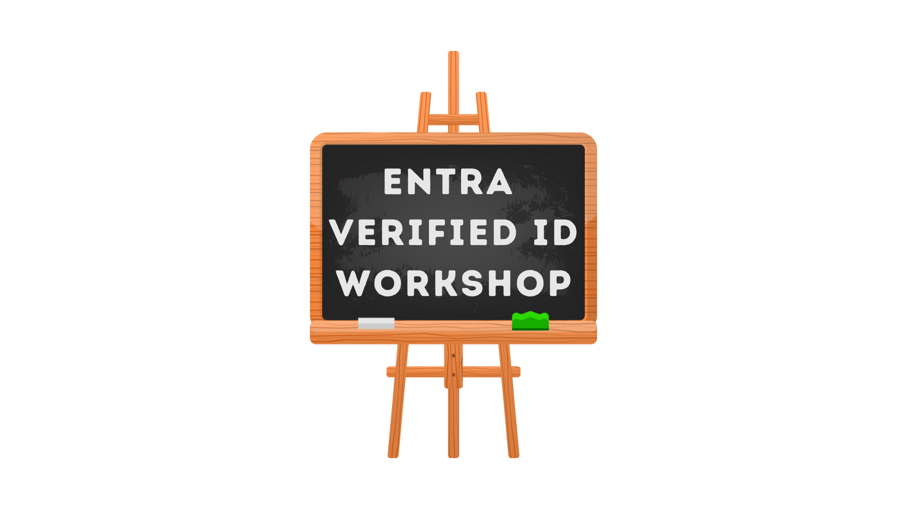
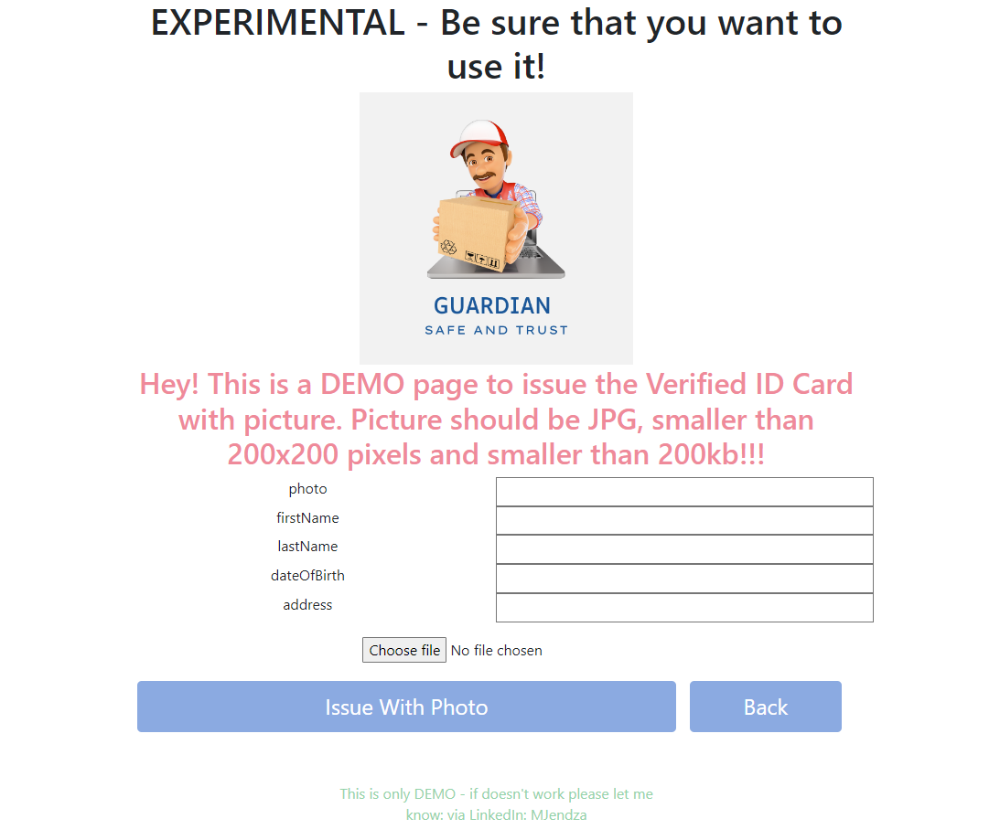
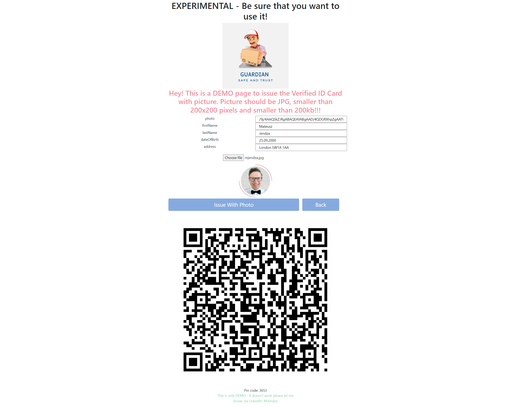
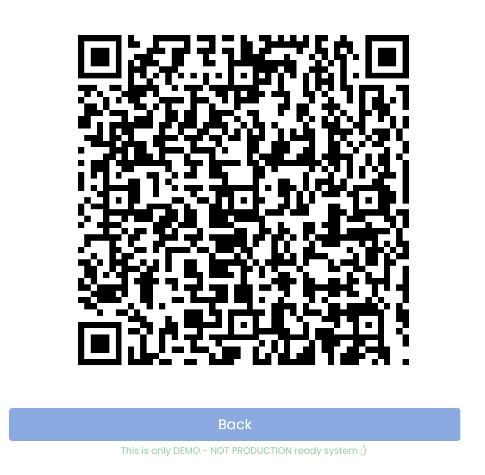
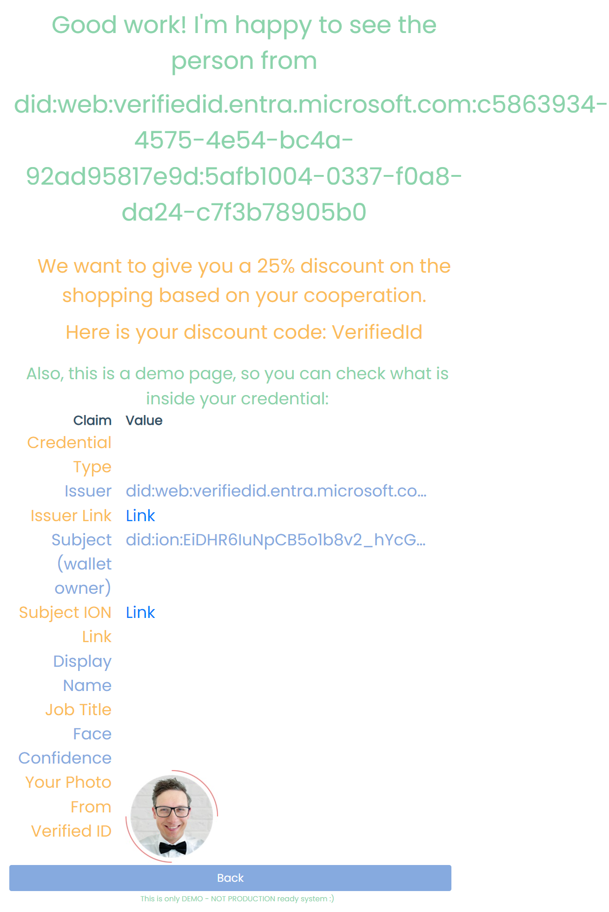

# Verified ID Workshop
## Start your journey with a Decentralized Identity. Create the first Verifiable Credential with the Entra Verified ID

## Prerequisites
### Technical
- [ ] [Entra ID Tenant](https://www.microsoft.com/en-gb/security/business/identity-access/microsoft-entra-id)
- [ ] Global administrator or the authentication policy administrator permission assigned is required.
- [ ] [Custom Domain is Registratered for tenant](https://learn.microsoft.com/en-us/entra/identity/users/domains-manage)
- [ ] Blob Storage Account to store logo (publicly accessible jpg/png file) - or Netlify site to host the logo (Azure Subscription)

- [ ] Visual Studio 2022 or Jetbrains Rider
- [ ] .NET 7 SDK

- [ ] ngrok (for local development) - or Cloudflare tunnel

### Skills
- [ ] basic knowledge of C# and .NET
- [ ] Basic understanding of Service Principal Authentication
- [ ] JavaScript - JQuery and Vanilla JS basics

## Achievements
- Know how to set up a Verified ID service.
- Deploy the own credentials and define the schema.

- Modify the sample application to build:
    - issueance request
    - presentation request
    - modify presentation request to require Face Check
    - cooperate with other issues, you can trust other attendees from the workshop

## Technical details
[My blog post](https://mjendza.net/post/entra-verified-id/)

[Basics of Verifiable Credentials](doc/basic/)

[MS Documentation](https://learn.microsoft.com/en-us/entra/verified-id/decentralized-identifier-overview)

## Workshop Steps
1. [Setup Verified ID](doc/stage-1/setup-verified-id.md)
2. [Create VC](doc/stage-2/create-vc.md)
3. [Service Principal](doc/stage-3/service-principal.md)
4. [Tunnel](doc/stage-4/ngrok.md)
5. [Issuance](doc/stage-5/issue.md)
6. [Presentation](doc/stage-6/present.md)
7. [Homework](doc/stage-7/homework.md)

## Demo
- [Issue](https://vc.factorlabs.pl/workshop/issue/demo-face-check.html)
- [Present](https://vc.factorlabs.pl/workshop/present/demo-face-check.html)
- [Present with Face Check](https://vc.factorlabs.pl/workshop/present/demo-face-check.html?faceCheckEnabled=1)

## Screens
### Issue VC

### Issue with all fields and QR Code

### Presentation Request

### Presentation Result

